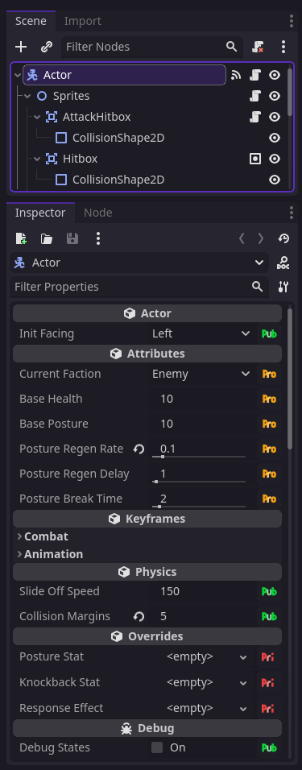
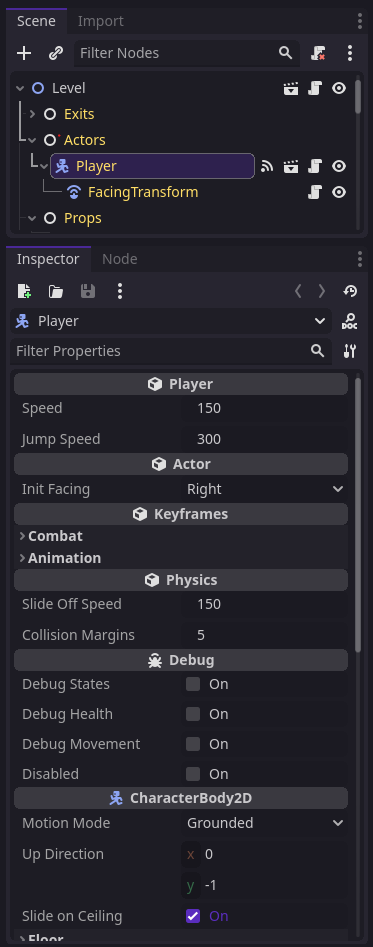

# Godot Private Exports

A Godot addon that adds access modifiers to exported variables in scenes. This can be used to prevent changes to exported variables that are only meant to be modified in the base scene or reduce clutter from the inspector.

## Usage

1. Install the addon from the AssetLib.
2. Activate the plugin from Project Settings > Plugin.
3. Navigate to the root node of a scene and the inspector will now contain access modifier buttons.
4. Update exports access modifier to `Private` or `Protected`
5. Navigate to a tree where the scene is instantiated. The `Private` exports will now be hidden!

## FAQ

**Q: Why don't I see the access modifier buttons?**

A: Make sure you're at the root node of a scene. Since only root node exports are visible in other scenes, only these variables can have access modifiers.

**Q: Why are access modifier from one scene not the same as another scene with the same script?**

A: The addon is designed around scenes, not scripts. Scenes can be treated as "classes" and scenes in other trees are treated as "instances". This is the reason `Protected` variables apply to inherited scenes, not inherited scripts. However, this is largely due to the limitation of Godot plugins, as it is currently not possible to add custom annotations to GDScript.

## Access Modifiers

- `Public`: Public exports are always visible.
- `Private`: Private exports are only visible in the base scene.
- `Protected`: Protected exports are only visible in the base scene and its inheritors.

| Actor.tscn                                             | Player.tscn (extends Actor)                                      | Level.tscn                                                |
| ------------------------------------------------------ | ---------------------------------------------------------------- | --------------------------------------------------------- |
|  |  |  |

> Private and protected exports can be used to fine-tune how exports are shown in other scenes.

## Editor Settings

| Setting      | Description                                                                                                                                            | Default  |
| ------------ | ------------------------------------------------------------------------------------------------------------------------------------------------------ | -------- |
| Display Mode | `Always`: modifier always shown   `Selected`: only shown on selected properties   `Modified`: only shown on modified and selected properties | `Always` |
